# Imágenes y vídeos sobre pruebas de validación

En este documento se muestran imágenes y vídeos como contenido adicional a algunas de las pruebas realizadas al sistema de conducción autónoma.

Estas pruebas han permitido conocer el alcance del agente autónomo desarrollado.

A continuación se muestra una reconstrucción en condiciones normales para que sea posible compararla con el resto.

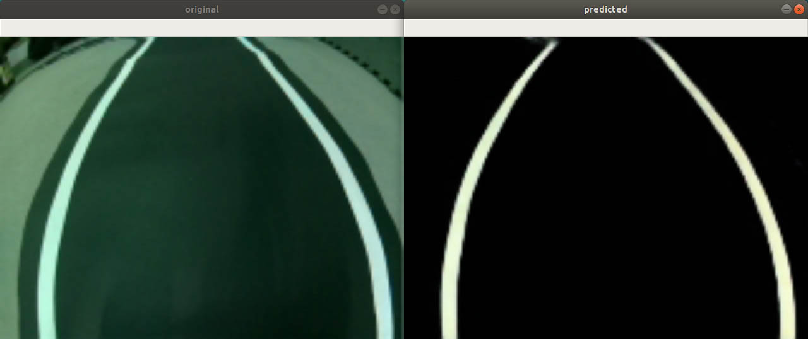

### **P-SCA-05 y P-SCA-06: Comprobar el funcionamiento del agente ante cambios de iluminación** 

En este caso se realizan variaciones en la iluminación del escenario, por ejemplo, sombras, brillos o cambios de iluminación en general.

Estos cambios podrían afectar a la reconstrucción de las líneas de la carretera, por lo que a continuación se muestran algunos ejemplos de reconstrucción.

- **Sombras:**

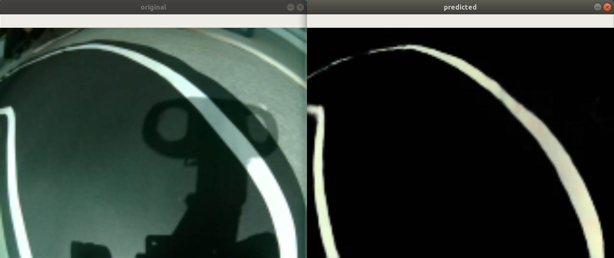 
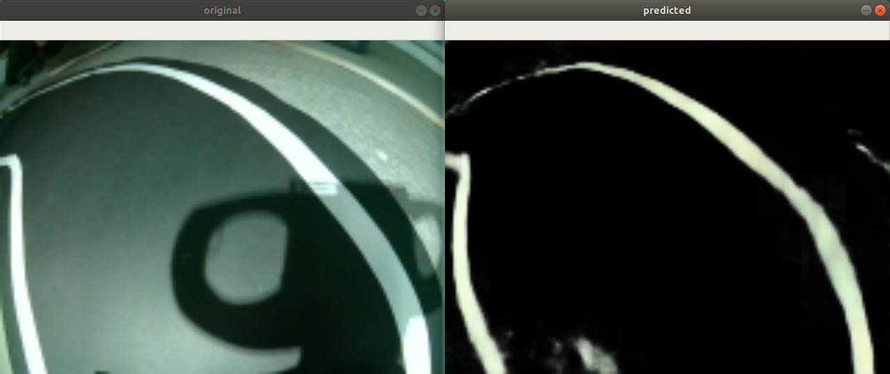

- **Brillos:**

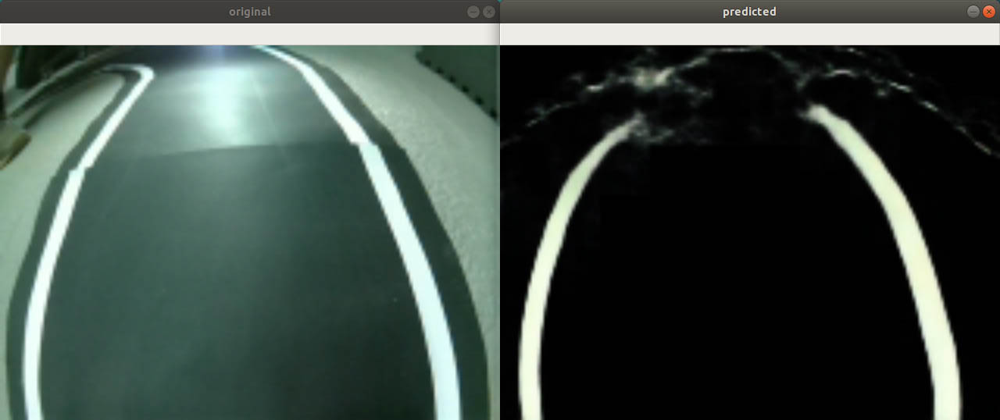 
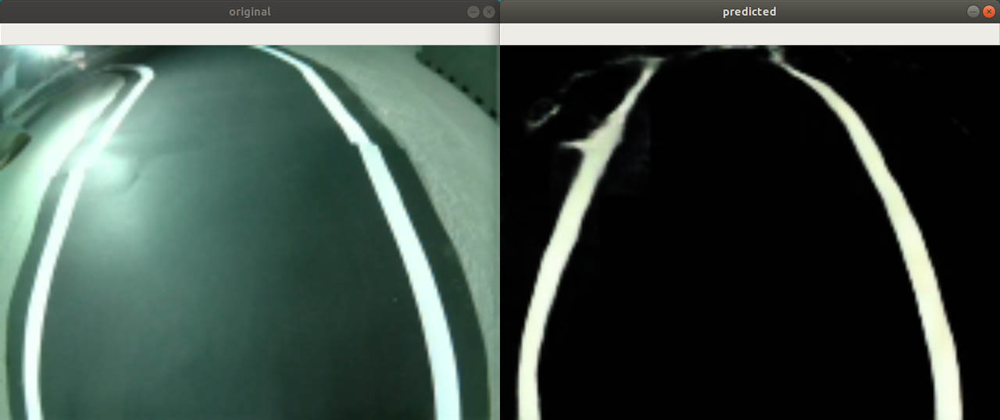

- **Disminución de la iluminación:**

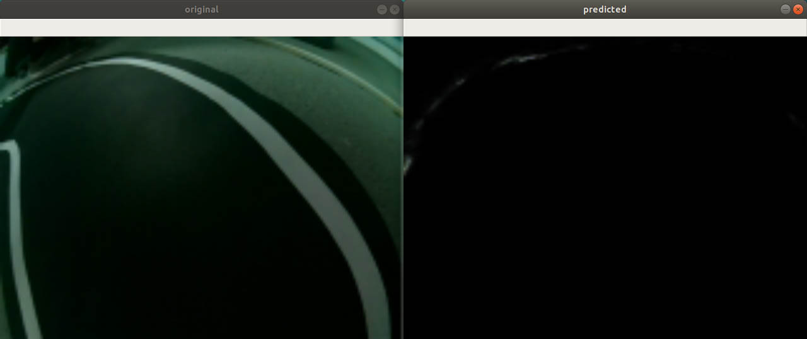 
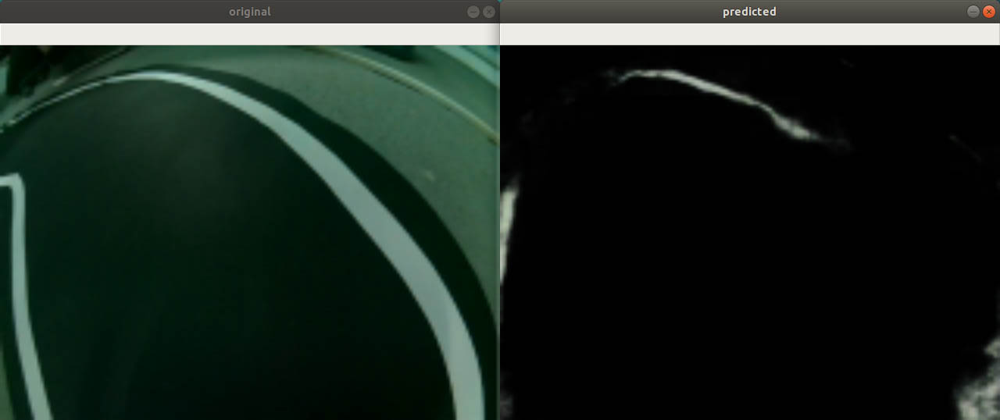

### **P-SCA-07 y P-SCA-08: Comprobar el funcionamiento del agente ante cambios en el escenario**

En este caso se realizan modificaciones en el escenario añadiendo objetos fuera del circuto, dentro e incluso tapando las líneas de la carretera.

Estos cambios podrían afectar a la reconstrucción de las líneas de la carretera, por lo que a continuación se muestran algunos ejemplos de reconstrucción.

- **Aparición de elementos fuera del recorrido:**

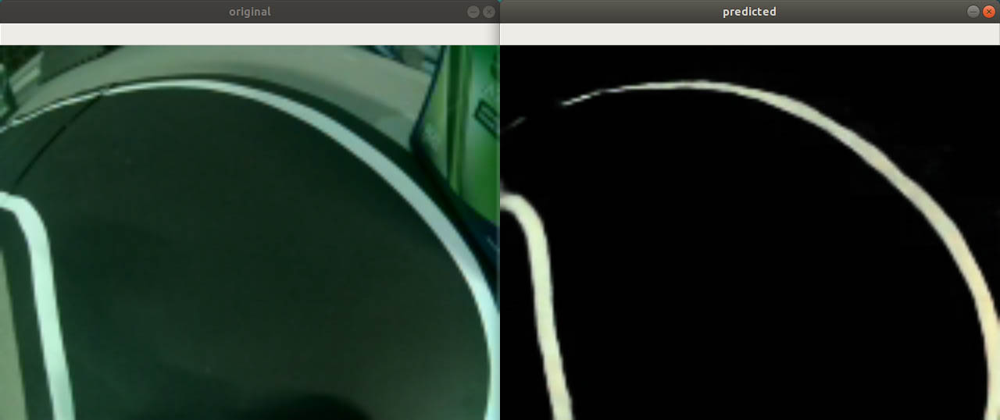 
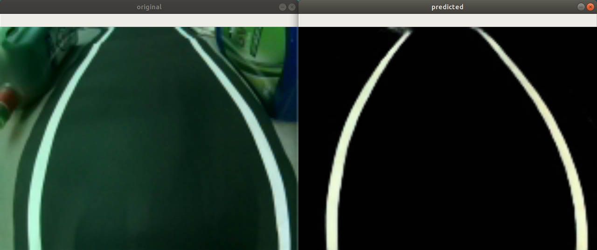

- **Aparición de elementos dentro del recorrido:**

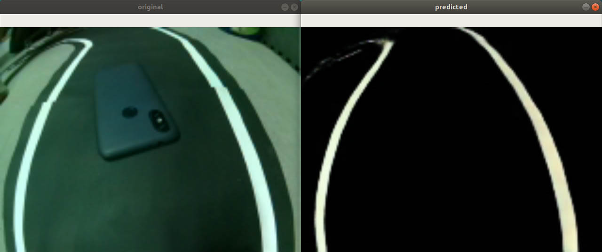 
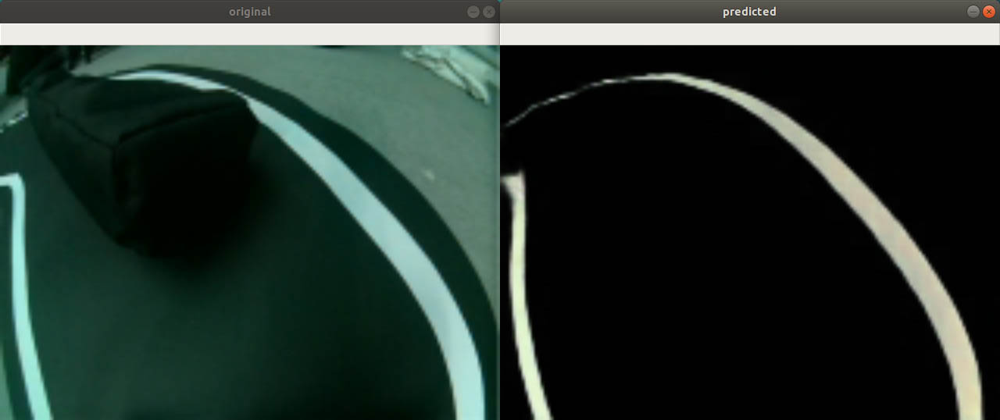

- **Aparición de elementos sobre las líneas de carretera:**

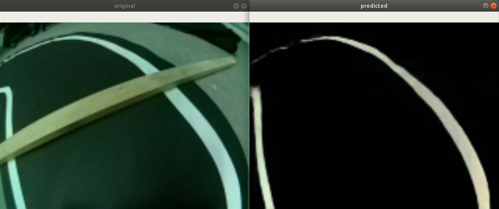 
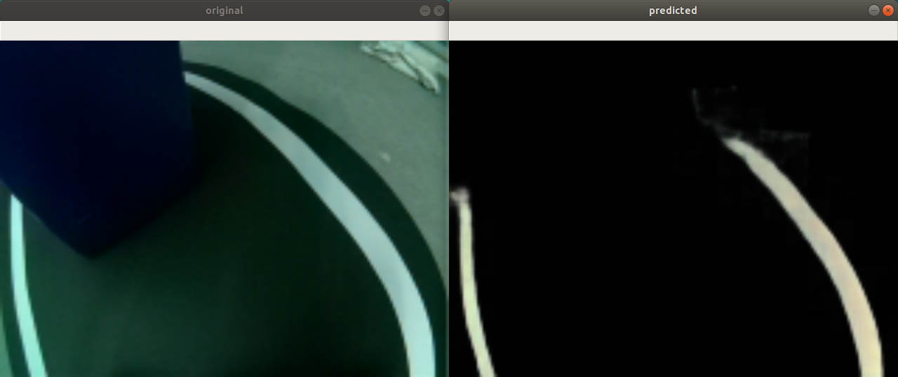 
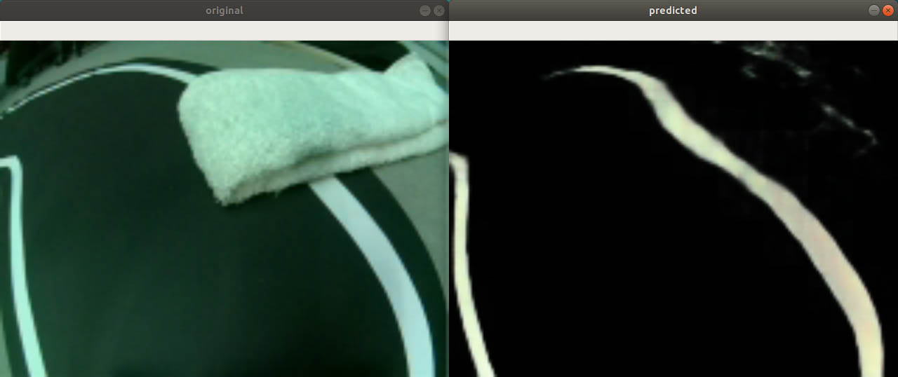 
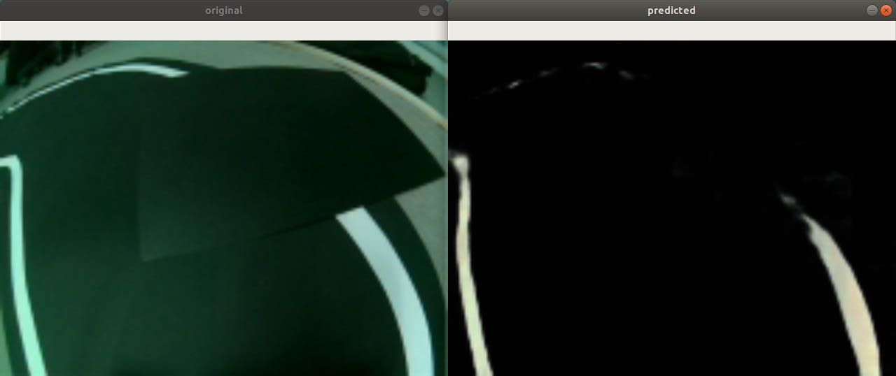

También se incluye un vídeo del agente en funcionamiento en situaciones en las que se tapan parcialmente las líneas de la carretera.

[**VÍDEO: Funcionamiento del agente tapando parcialmente las líneas**][video2]

<a title="Validación: Funcionamiento del agente tapando parcialmente las líneas" href="https://youtu.be/2TOGlO2U5LE" target="_blank">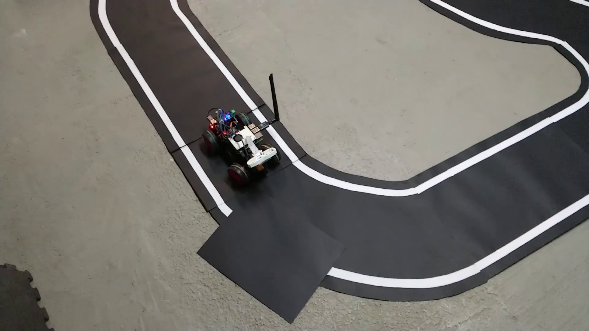</a>

Enlace: https://youtu.be/2TOGlO2U5LE

### **P-SCA-09: Comprobar el funcionamiento del agente en el escenario objetivo montando el circuito de otra forma (diferente al que ha sido utilizado para entrenar)**

En este caso se hace referencia a un vídeo en el que se puede visualizar la reconstrucción y la conducción autónoma en un recorrido diferente al que ha sido utilizado para entrenar.

[**VÍDEO: Circuito diferente - Reconstrucción y conducción autónoma**][video1]

<a title="Circuito diferente - Reconstrucción y conducción autónoma" href="https://youtu.be/bRh781L_FCo" target="_blank">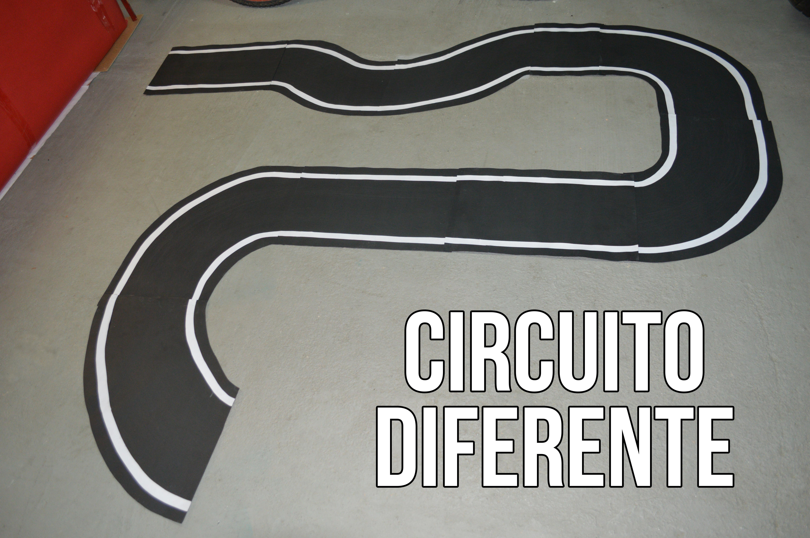</a>

Enlace: https://youtu.be/bRh781L_FCo

### **P-SCA-10: Comprobar la reconstrucción del Autoencoder en el escenario objetivo en un tramo de carretera que represente un cruce (tramo no visto en entrenamiento)**

En este caso se muestra la reconstrucción obtenida por el _Autoencoder_ en un caso no visto en entrenamiento.

Aunque la reconstrucción no es muy buena, se puede observar como el Autoencoder trata de reconstruir algo parecido a dos curvas a cada lado del cruce.

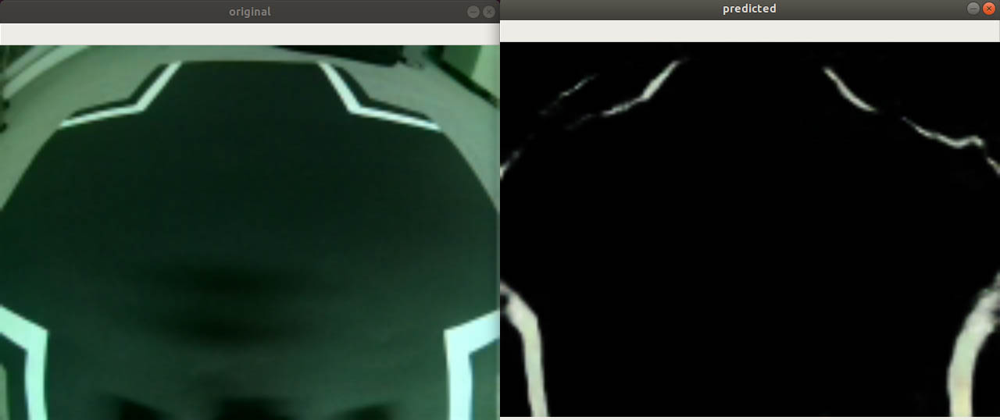 
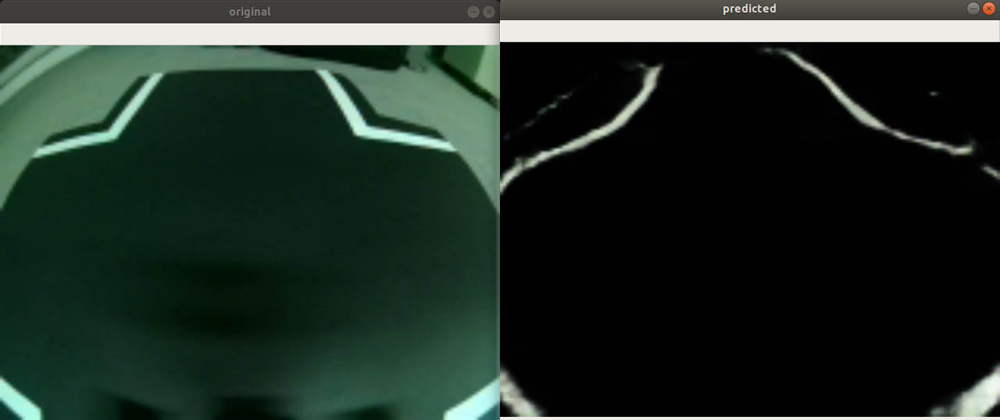

### **P-SCA-11: Comprobar el funcionamiento del agente sobre el circuito inicial pero en un escenario diferente para el que ha sido entrenado**

En este caso se muestra la reconstrucción dada por el _Autoencoder_ en el mismo circuito pero en un escenario diferente.

El agente no obtiene reconstrucciones muy malas e intenta seguir el recorrido, pero pierde el control constantemente.

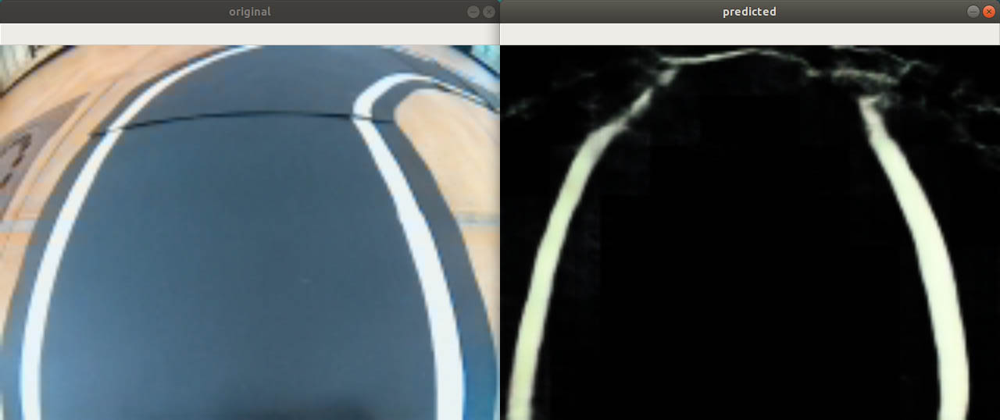 
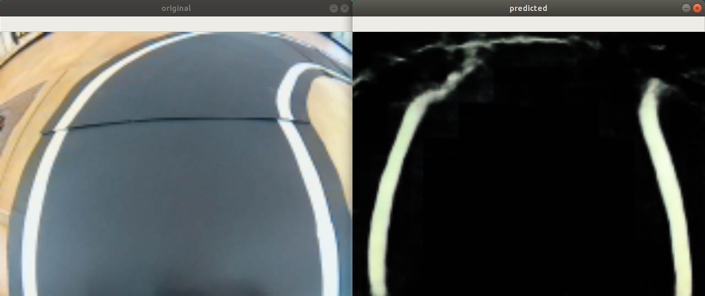

[video1]: https://youtu.be/bRh781L_FCo
[video2]: https://youtu.be/2TOGlO2U5LE