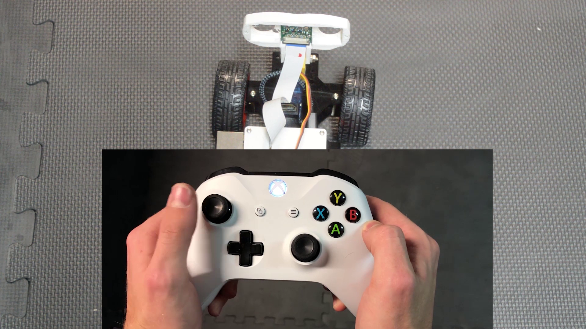
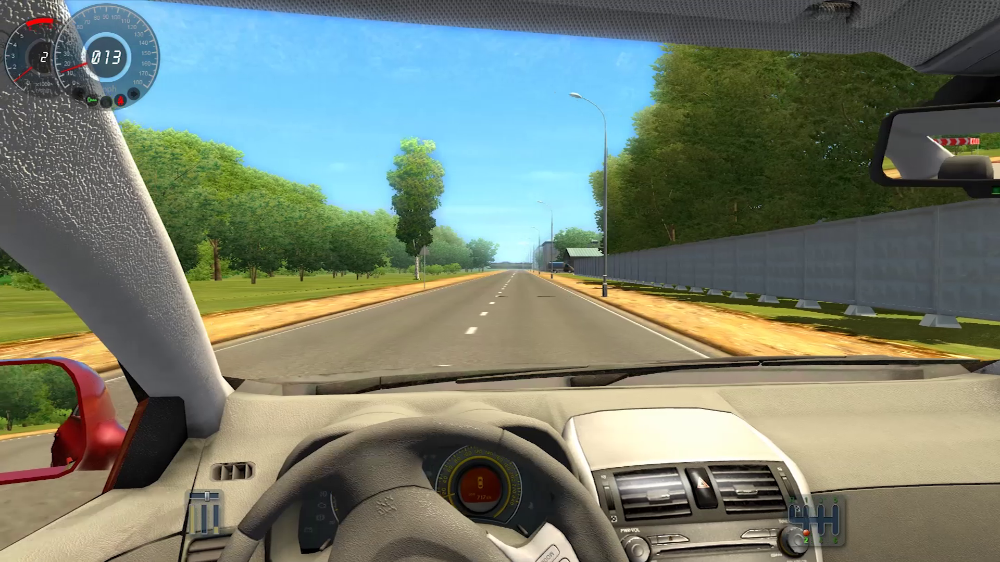
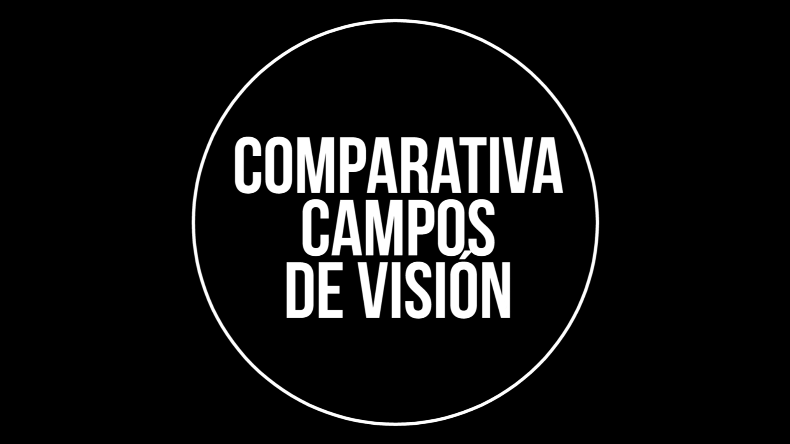
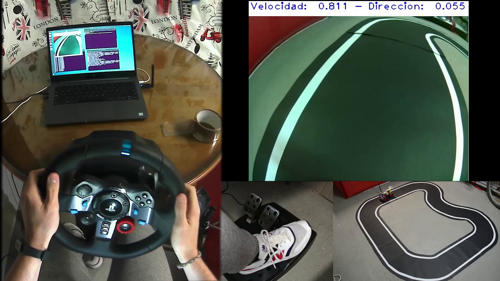

# Vídeos de la Fase III
## Sistema de control y obtención de datos de entrenamiento

- [**Vídeo 3.1: Comparativa de radios de giro**][video1]

Enlace: https://youtu.be/4Em6y0v9NZ8

- [**Vídeo 3.2: Conducción con mando**][video2]

Enlace: https://youtu.be/e35TZem0xAc

- [**Vídeo 3.3: Determinación de FPS necesarios para conducir - Control con Logitech G29**][video3]

Enlace: https://youtu.be/aw6TSHciiv0

- [**Vídeo 3.4: Comparativa de campos de visión**][video4]

Enlace: https://youtu.be/QarCcYTK7sc

- [**Vídeo 3.5: Sistema de control y obtención de datos de entrenamiento**][video5]

Enlace: https://youtu.be/f6zvYl4ueuw

[video1]: https://youtu.be/4Em6y0v9NZ8
[video2]: https://youtu.be/e35TZem0xAc
[video3]: https://youtu.be/aw6TSHciiv0
[video4]: https://youtu.be/QarCcYTK7sc
[video5]: https://youtu.be/f6zvYl4ueuw
